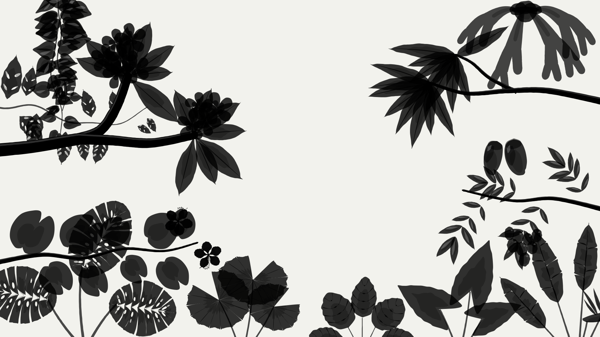

<div align="center">

<a href="https://benji.appcubic.com">
  <picture>
    <source media="(prefers-color-scheme: dark)" srcset=".github/assets/garden-night.svg">
    
  </picture>
</a>

# Benji Peng, Ph.D.

Scientist and entrepreneur.<br>
A contact card in a garden that grows as you scroll,<br>
tropical by day and Mediterranean by night.

[](https://benji.appcubic.com)
[](https://github.com/benjipeng/benji/actions/workflows/deploy.yml)
[](https://vite.dev)
[](https://www.typescriptlang.org)
[](https://animejs.com)

</div>

## Two gardens

Every plant is drawn by code in the manner of a botanical plate: ink contours,
fine on the lit side and heavier in shadow, over layered watercolor glazes.

**By day, a tropical garden.** Frangipani, mango, lychee, and orchid tree
branches reach in from the edges. A staghorn fern and a heart-leaf philodendron
hang from above. Monstera, bird of paradise, alocasia, calathea, a fan palm,
and a Swiss cheese vine fill out the bed.

**By night, a Mediterranean terrace in the dry season.** Olive, fig, lemon, and
stone pine branches reach in. Grapevine, star jasmine, and bougainvillea fall
from the pergola. Italian cypress, lavender, rosemary, agave, and acanthus
rise from the bed, under a moon-silver ink, with fruit and night flowers that
glow against the dark.

Scrolling makes the garden grow. Branches lengthen, and leaves, flowers, and
fruit unfold where they attach. On phones and tablets the garden grows on its
own. Switching the theme grows the other garden in.

## Craft

- **Drawn, not downloaded.** A seeded script draws all twenty-four plants as
  SVG, so each leaf and petal can be redrawn exactly. Color lives in one token
  file, a day set and a night set, with one base tone per species shifted
  shape by shape.
- **Composed for every screen.** Each garden has a layout for every screen
  size, and wider screens show more plants. A small solver spaces them so they
  overlap less. Only the garden on show is downloaded, and only the plants
  its layout uses.
- **Light to run.** The GPU draws the garden only while it grows, at most 30
  times a second. At rest, nothing runs.
- **Considerate.** All content is static HTML. With reduced motion, the garden
  appears fully grown and still.

## Develop

```bash
npm install
npm run dev                    # serve locally, with the token gallery at /gallery/
npm run build                  # type-check and build into dist/
node scripts/garden/draw.mjs   # redraw the garden
```

Content and links live in `index.html`. Colors live in `src/tokens.css`, the
plant registry in `src/garden/plants.json`, and the drawings in
`scripts/garden/`. Design and maintenance notes are in [`AGENTS.md`](AGENTS.md).
Every push to `main` deploys to GitHub Pages.

<div align="center">
<sub>Built with <a href="https://appautomaton.com">App Automaton</a> by <a href="https://www.appcubic.com">AppCubic</a></sub>
</div>
